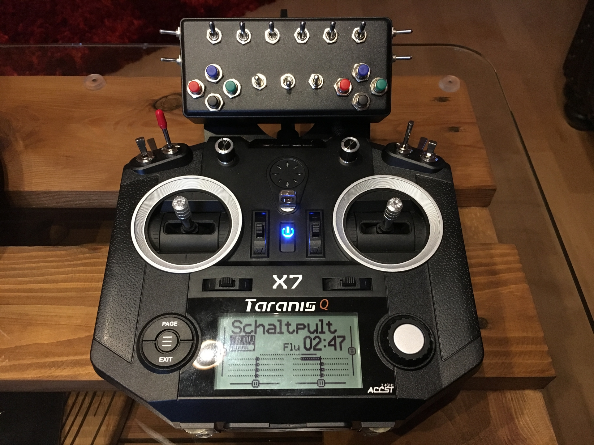

## Schaltpult fuer openTX-Sender
 
 

 
 
Eingänge für 16 zusätzliche Schalter.  
16 Schalteingänge mit diesen Schalterkonfigurationen sind, beliebig kombiniert, nutzbar:  
•  2-Pos-Schalter oder Taster mit Wechselkontakt. Ausgabewert: -100%, +100%  
•  3-Pos-Schalter oder Taster mit Wechselkontakt. Ausgabewert: -100%, 0%, +100%  
•  Doppeltaster (2 Taster auf einem Eingang/Kanal). Ausgabewert: -100%, 0%, +100%  
•  Schalter oder Taster mit Schließerkontakt mit Pullup-Widerstand. Ausgabewert: -100%, +100%  
•  Schalter oder Taster mit Schließerkontakt ohne Pullup-Widerstand. Ausgabewert: -100%, 0%  
Unbenutzte Eingänge bleiben unbeschaltet. Siehe auch Beschaltungsbeispiele im Schaltplan.  
 
Die Schaltung erzeugt ein 16-Kanal PPM Signal, abhängig von der jeweiligen Schalterstellung.  
Dies wird über die Trainer-Buchse oder den Modulschacht in die Fernsteuerung eingespeist.  
Die Versorgungsspannung muss 7 – 14 V betragen.  
 
Entwickelt wurde die Schaltung für die Möglichkeiten von OpenTX Fernsteuerungen.  
Evtl. können aber auch andere Systeme das PPM-Signal nutzen.  

# English:  
For now all documents are written in German. I will support English requests as well  